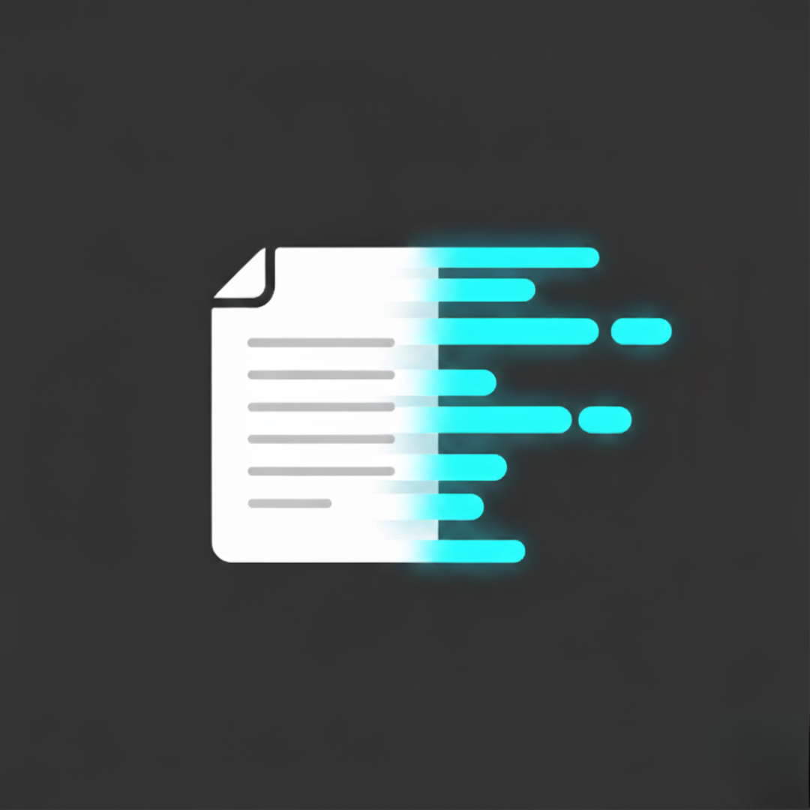

<div align="left">
  <h1 style="display: inline-block; margin: 0;">Snip</h1>
  
</div>

A fast and efficient command-line note-taking tool built with Go. Snip helps you capture, organize, and search your notes.

## ✨ Features

### Current Functionality

- **📝 Create Notes**: Quickly create new notes with title and content
- **📋 List Notes**: View all your notes with chronological sorting options
- **🔍 Search Notes**: Full-text search across all notes using SQLite FTS4
- **✏️ Edit Notes**: Update existing notes using your preferred editor
- **📖 Get Notes**: Retrieve specific notes by ID
- **⚡ Fast Performance**: SQLite database with optimized indexes
- **🔧 Editor Integration**: Supports nano, vim, vi, or custom `$EDITOR`

### Command Examples

```bash
# Create a new note
snip create "Meeting Notes"

# List all notes (newest first)
snip list

# List notes chronologically (oldest first)
snip list --asc

# List with verbose information
snip list --verbose

# Search for notes containing specific terms
snip find "meeting"

# Edit an existing note
snip update 1

# Get a specific note by ID
snip show 1
```

## 🚀 Installation

### From Source

```bash
git clone https://github.com/matheuzgomes/snip.git
cd snip
go build -o snip main.go
sudo mv snip /usr/local/bin/
```

### Using GoReleaser (Coming Soon)

We're setting up automated releases using [GoReleaser](https://goreleaser.com/) for easy installation:

In construction...

## 🗄️ Data Storage

Snip stores your notes in a SQLite database located at `~/.snip/notes.db`. The database includes:

- **Main Table**: Stores notes with metadata (ID, title, content, timestamps)
- **FTS Table**: Full-text search index for fast searching
- **Automatic Triggers**: Keeps search index synchronized with your notes

## 🔧 Configuration

### Editor Selection

Snip automatically detects your preferred editor in this order:

1. `$EDITOR` environment variable
2. `nano` (if available)
3. `vim` (if available)
4. `vi` (fallback)
5. more to come... :)

### Database Location

The database is automatically created at `~/.snip/notes.db`. You can backup your notes by copying this file.

## 🛠️ Development

### Prerequisites

- Go 1.21 or later
- SQLite3 development libraries

### Building

```bash
git clone https://github.com/yourusername/snip.git
cd snip
go mod download
go build -o snip main.go
```

### Running Tests

In construction...

## 🗺️ Roadmap

### Coming Soon

- ~~**🗑️ Delete Notes**: Remove notes you no longer need~~
- **🏷️ Tags**: Organize notes with custom tags
- **📁 Categories**: Group notes into categories
- **🔗 Note Linking**: Link related notes together
- **📤 Export**: Export notes to various formats (Markdown, JSON, etc.)

### Release Automation

We're implementing [GoReleaser](https://goreleaser.com/) for:

- **Automated Builds**: Cross-platform binary generation
- **Release Management**: Automated GitHub releases
- **Package Distribution**: Homebrew, Snap, and other package managers
- **Docker Images**: Containerized distribution
- **Code Signing**: Secure, signed releases

## 🙏 Acknowledgments

- Built with [Cobra](https://github.com/spf13/cobra) for CLI functionality
- Uses [SQLite](https://sqlite.org/) with FTS4 for fast text search
- Inspired by modern note-taking tools and CLI utilities

**Made with ❤️ for anyone who wants to take notes**
