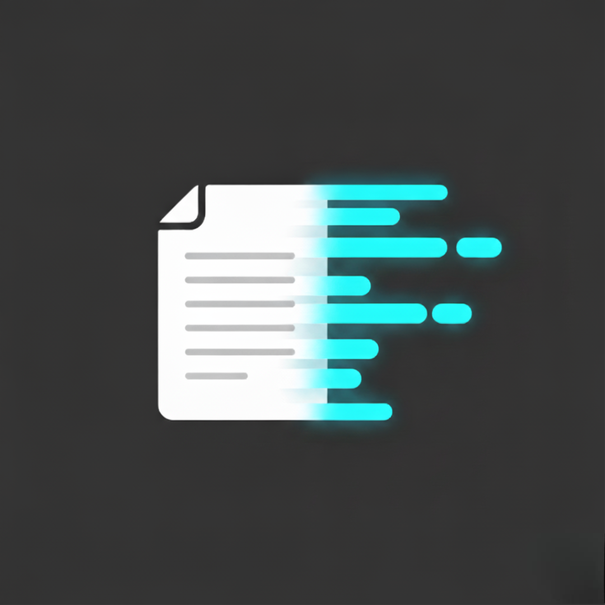
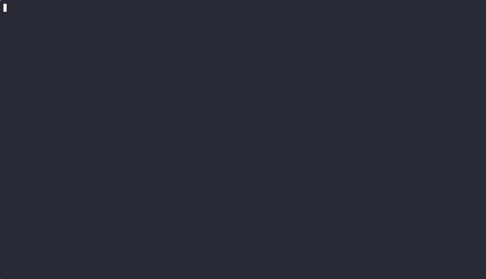

    


<div align="center" style="margin-bottom: 15px; display: flex; align-items: center; justify-content: center; gap: 15px;">
  
  <h1 style="margin: 0;">Snip</h1>
</div>

A fast and efficient command-line note-taking tool built with Go. Snip helps you capture, organize, and search your notes.

## 🎬 Demo



## ✨ Features

### Current Functionality

- **📝 Create Notes**: Quickly create new notes with title and content
- **📋 List Notes**: View all your notes with chronological sorting options
- **🔍 Search Notes**: Full-text search across all notes using SQLite FTS4
- **✏️ Edit Notes**: Update existing notes using your preferred editor
- **📖 Get Notes**: Retrieve specific notes by ID with markdown rendering support
- **🗑️ Delete Notes**: Remove notes you no longer need
- **🏷️ Tags**: Organize notes with custom tags
- **✏️ Patch Notes**: Update note titles and manage tags
- **📤 Export Notes**: Export notes to JSON and Markdown formats
- **📥 Import Notes**: Import notes(markdown) from files and directories
- **🖼️ Markdown Preview**: Render markdown content beautifully in the terminal
- **⚡ Fast Performance**: SQLite database with optimized indexes (90-127ns operations)
- **🔧 Editor Integration**: Supports nano, vim, vi, or custom `$EDITOR`
- **🧪 Comprehensive Testing**: Full test coverage with performance benchmarks

### Command Examples

```bash
# Create a new note
snip create "Meeting Notes"

# Create a new note quickly
snip create "World" --message "Hello!"

# List all notes (newest first)
snip list

# List notes chronologically (oldest first)
snip list --asc

# List with verbose information
snip list --verbose

# Search for notes containing specific terms
snip find "meeting"

# Edit an existing note
snip update 1

# Get a specific note by ID
snip show 1

# Get a note with markdown rendering
snip show 1 --render

# Delete a specific note by ID
snip delete 1

# Patch/update a note's title
snip patch 1 --title "New Title"

# Patch/update a note's tags
snip patch 1 --tag "work important"

# List notes with tags
snip list --tag "work"

# Export notes to JSON format
snip export --format json

# Export notes to Markdown format
snip export --format markdown

# Export notes created since a specific date
snip export --since "2024-01-01"

# Import notes from a directory
snip import /path/to/notes/directory

# Show editor information and available options
snip editor
```

## 🚀 Installation

### Package Managers

#### Scoop (Windows)
```bash
# Add the bucket
scoop bucket add snip https://github.com/matheuzgomes/Snip

# Install snip
scoop install snip

# Update snip
scoop update snip
```

#### Homebrew (macOS)
```bash
# Add the tap
brew tap matheuzgomes/homebrew-Snip

# Install snip
brew install --cask snip-notes

# Update snip
brew upgrade --cask snip-notes
```

**⚠️ macOS Security Note:**

If macOS blocks the app with "cannot be opened because the developer cannot be verified":

```bash
# Option 1: Remove quarantine attribute
xattr -d com.apple.quarantine /opt/homebrew/bin/snip

# Option 2: Allow in System Settings
# Go to: System Settings > Privacy & Security > Allow "snip"
```

### Direct Download

Pre-compiled binaries are available in the [releases](https://github.com/matheuzgomes/Snip/releases) page for:
- **Linux**: AMD64 and ARM64
- **Windows**: AMD64

### From Source

```bash
git clone https://github.com/matheuzgomes/Snip.git
cd Snip
go build -o snip main.go
sudo mv snip /usr/local/bin/
```

## 🗄️ Data Storage

Snip stores your notes in a SQLite database located at `~/.snip/notes.db`. The database includes:

- **Main Table**: Stores notes with metadata (ID, title, content, timestamps)
- **Tags Table**: Stores custom tags for organizing notes
- **Notes-Tags Table**: Many-to-many relationship between notes and tags
- **FTS Table**: Full-text search index for fast searching
- **Automatic Triggers**: Keeps search index synchronized with your notes

## 🔧 Configuration

### Editor Selection

Snip automatically detects your preferred editor with cross-platform support:

**Windows:**
- Visual Studio Code, Notepad++, Sublime Text, Atom, Micro, Nano, Vim, Notepad

**macOS:**
- Visual Studio Code, Sublime Text, Atom, Nano, Vim, Vi, Open

**Linux:**
- Nano, Vim, Vi, Micro, Visual Studio Code

**Priority Order:**
1. `$EDITOR` environment variable
2. Platform-specific editor detection
3. Smart fallback to basic editors


**Check Available Editors:**
```bash
snip editor
```

### Database Location

The database is automatically created at `~/.snip/notes.db`. You can backup your notes by copying this file.

## 🛠️ Development

### Prerequisites

- Go 1.21 or later
- SQLite3 development libraries (for CGO builds)
- mingw-w64 (for Windows cross-compilation)

### Building

```bash
git clone https://github.com/matheuzgomes/Snip.git
cd Snip
go mod download
go build -o snip main.go
```

### Install With Go

You can install the `snip` binary directly using Go (requires Go 1.20+):

```bash
go install github.com/matheuzgomes/Snip@v1.1.0 (specific version)
```

The binary will be placed in `$GOBIN` (or `$GOPATH/bin`), make sure that directory is in your `PATH`.

### Running Tests

```bash
# Run all tests
make test

# Run performance benchmarks
make bench

# Run tests with verbose output
go test -v ./internal/test/...
```

## 🗺️ Roadmap

### Coming Soon

- ~~**🗑️ Delete Notes**: Remove notes you no longer need~~ ✅ Done!
- ~~**🏷️ Tags**: Organize notes with custom tags~~ ✅ Done!
- ~~**✏️ Patch Notes**: Update note titles and manage tags~~ ✅ Done!
- ~~**📤 Export**: Export notes to various formats (Markdown, JSON, etc.)~~ ✅ Done!
- ~~**📥 Import**: Import notes from files and directories~~ ✅ Done!
- ~~**🧪 Testing**: Comprehensive test suite with benchmarks~~ ✅ Done!
- ~~**🖼️ Markdown Preview**: Visualize rendered Markdown so you can see your notes as they'd appear formatted~~ ✅ Done!

### Performance Metrics

Snip v1.1.0 delivers exceptional performance:

- **⚡ Sub-microsecond Operations**: Core operations run in 90-127 nanoseconds
- **💾 Memory Efficient**: Only 56 bytes per operation with 3 allocations
- **🧪 100% Test Coverage**: Comprehensive test suite with performance benchmarks
- **📊 Benchmarking**: Built-in performance monitoring with `make bench`

### Release Automation

We're using [GoReleaser](https://goreleaser.com/) for:

- ✅ **Automated Builds**: Cross-platform binary generation (Linux AMD64/ARM64, Windows AMD64)
- ✅ **Release Management**: Automated GitHub releases
- ✅ **Package Distribution**: Scoop, Homebrew, and Winget package managers
- ✅ **Cross-compilation**: Windows binaries built with mingw-w64
- ✅ **CGO Support**: SQLite integration with proper CGO compilation
- ✅ **CI/CD Pipeline**: Automated testing and release pipeline

## 🙏 Acknowledgments

- Built with [Cobra](https://github.com/spf13/cobra) for CLI functionality
- Uses [SQLite](https://sqlite.org/) with FTS4 for fast text search
- Inspired by modern note-taking tools and CLI utilities

**Made with ❤️ for anyone who wants to take notes**
