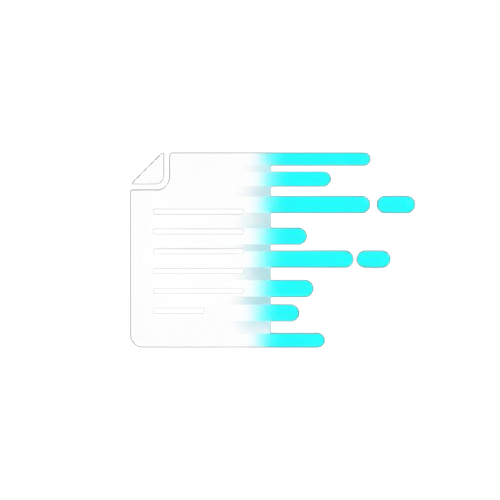

    


<div align="left" style="margin-bottom: 15px; display: flex; align-items: flex-start; margin-left: -20px;">
  
  <h1 style="margin: 0; margin-top: 3px;">Snip</h1>
</div>

A fast and efficient command-line note-taking tool built with Go. Snip helps you capture, organize, and search your notes.

## ✨ Features

### Current Functionality

- **📝 Create Notes**: Quickly create new notes with title and content
- **📋 List Notes**: View all your notes with chronological sorting options
- **🔍 Search Notes**: Full-text search across all notes using SQLite FTS4
- **✏️ Edit Notes**: Update existing notes using your preferred editor
- **📖 Get Notes**: Retrieve specific notes by ID
- **🗑️ Delete Notes**: Remove notes you no longer need
- **🏷️ Tags**: Organize notes with custom tags
- **✏️ Patch Notes**: Update note titles and manage tags
- **⚡ Fast Performance**: SQLite database with optimized indexes
- **🔧 Editor Integration**: Supports nano, vim, vi, or custom `$EDITOR`

### Command Examples

```bash
# Create a new note
snip create "Meeting Notes"

# Create a new note quickly
snip create "World" --message "Hello!"

# List all notes (newest first)
snip list

# List notes chronologically (oldest first)
snip list --asc

# List with verbose information
snip list --verbose

# Search for notes containing specific terms
snip find "meeting"

# Edit an existing note
snip update 1

# Get a specific note by ID
snip show 1

# Delete a specific note by ID
snip delete 1

# Patch/update a note's title
snip patch 1 --title "New Title"

# Patch/update a note's tags
snip patch 1 --tag "work important"

# List notes with tags
snip list --tag "work"
```

## 🚀 Installation

### Package Managers

#### Scoop (Windows)
```bash
# Add the bucket
scoop bucket add snip https://github.com/matheuzgomes/Snip

# Install snip
scoop install snip

# Update snip
scoop update snip
```

#### Homebrew (macOS/Linux)
```bash
# Add the tap
brew tap matheuzgomes/Snip

# Install snip
brew install snip

# Update snip
brew upgrade snip
```

### Direct Download

Pre-compiled binaries are available in the [releases](https://github.com/matheuzgomes/Snip/releases) page for:
- **Linux**: AMD64 and ARM64
- **Windows**: AMD64

### From Source

```bash
git clone https://github.com/matheuzgomes/Snip.git
cd Snip
go build -o snip main.go
sudo mv snip /usr/local/bin/
```

## 🗄️ Data Storage

Snip stores your notes in a SQLite database located at `~/.snip/notes.db`. The database includes:

- **Main Table**: Stores notes with metadata (ID, title, content, timestamps)
- **Tags Table**: Stores custom tags for organizing notes
- **Notes-Tags Table**: Many-to-many relationship between notes and tags
- **FTS Table**: Full-text search index for fast searching
- **Automatic Triggers**: Keeps search index synchronized with your notes

## 🔧 Configuration

### Editor Selection

Snip automatically detects your preferred editor in this order:

1. `$EDITOR` environment variable
2. `nano` (if available)
3. `vim` (if available)
4. `vi` (fallback)
5. more to come... :)

### Database Location

The database is automatically created at `~/.snip/notes.db`. You can backup your notes by copying this file.

## 🛠️ Development

### Prerequisites

- Go 1.21 or later
- SQLite3 development libraries (for CGO builds)
- mingw-w64 (for Windows cross-compilation)

### Building

```bash
git clone https://github.com/matheuzgomes/Snip.git
cd Snip
go mod download
go build -o snip main.go
```

### Running Tests

In construction...

## 🗺️ Roadmap

### Coming Soon

- ~~**🗑️ Delete Notes**: Remove notes you no longer need~~ ✅ Done!
- ~~**🏷️ Tags**: Organize notes with custom tags~~ ✅ Done!
- ~~**✏️ Patch Notes**: Update note titles and manage tags~~ ✅ Done!
- **📁 Categories**: Group notes into categories
- **🔗 Note Linking**: Link related notes together
- **📤 Export**: Export notes to various formats (Markdown, JSON, etc.)

### Release Automation

We're using [GoReleaser](https://goreleaser.com/) for:

- ✅ **Automated Builds**: Cross-platform binary generation (Linux AMD64/ARM64, Windows AMD64)
- ✅ **Release Management**: Automated GitHub releases
- ✅ **Package Distribution**: Scoop, Homebrew, and Winget package managers
- ✅ **Cross-compilation**: Windows binaries built with mingw-w64
- ✅ **CGO Support**: SQLite integration with proper CGO compilation

## 🙏 Acknowledgments

- Built with [Cobra](https://github.com/spf13/cobra) for CLI functionality
- Uses [SQLite](https://sqlite.org/) with FTS4 for fast text search
- Inspired by modern note-taking tools and CLI utilities

**Made with ❤️ for anyone who wants to take notes**
